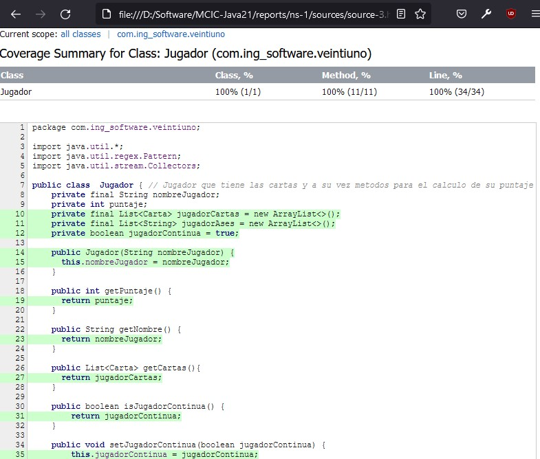

# 21 - Black Jack - desarrollo basado en pruebas

## Integrantes

- Lider: Norbey Danilo Muñoz
- Javier Hospital Melo
- Brayan Leonardo Sierra
- Juan Sebastián Sánchez
- Camilo Enrique Rocha
- Ivan Daniel Villegas

### Entorno de desarrollo

```
IntelliJ IDEA
JDK 11 (Corretto version installed by Intellij IDEA)
Maven 3.8.2
```

## Historias de usuario

### Jugador

- :white_check_mark: __Como__ jugador __quiero__ que al inicio del juego me repartan dos cartas, __para__ calcular si deseo otra carta o me planto.

- :white_check_mark: __Como__ jugador __quiero__ recibir todas las cartas que solicite a la casa siempre y cuando mi mano no supere 21 puntos, __para__ incrementar el valor de mi mano.

- :white_check_mark: __Como__ jugador __quiero__ tener una mano mayor al puntaje de la casa y menor a 21 puntos __para__ ganar el juego.

### Casa

- :white_check_mark:	__Como__ casa __quiero__ que al inicio del juego me repartan dos cartas, __para__ calcular si deseo otra carta o me planto.

- :white_check_mark: __Como__ casa __quiero__ recibir todas las cartas necesarias __para__ intentar llegar a 21 para vencer al jugador.

- :white_check_mark: __Como__ casa __quiero__ realizar el conteo para mi mano y la del jugador __para__ establecer el ganador y terminar la partida.

- :white_check_mark:	__Como__ casa __quiero__ conocer el resultado final del juego __para__ saber el ganador.


## Reglas

- Solo existen 2 jugadores, el jugador real y la computadora
- Existe solo un repartidor, este será la computadora

- La banca también juega pero tiene unas reglas muy definidas que se han de tener en cuenta. Si la suma de las cartas de la banca es 16 o menos, debe pedir carta y si suman 17 o más se debe plantar.

- ¿Cuándo gana y cuando pierde la banca? La banca gana a todos los jugadores que se pasen de 21 y a aquellos que tengan un jugada de menor valor, por otro lado, empata con aquellos jugadores que tengan la misma suma. La mano de la banca pierde con los jugadores que tengan una mano superior a la suya o, si la banca se pasa, con todos aquellos que se plantaron, tengan la suma de puntos que tengan.

- El As es la única carta de la baraja que tiene dos valores, 1 y 11, siendo el jugador que lo posea quien elige el valor entre ambos según le convenga. En caso que la suma con el valor 11 de un valor mayor a 21 el As tendra automaticamente el valor de 1.

- Las cartas numeradas con índice del dos al diez tienen el valor correspondiente a su numeración.

- Por su parte, todas las figuras (Jack, Queen y King), tienen el mismo valor: 10. Importante dato para el jugador, es saber que en 52 cartas, hay 16 con un valor de 10.

- **Plantarse:** Ya sea de inicio o tras haber pedido carta, si el jugador considera que tiene una jugada que puede ganar, o que pedir más cartas podría hacerle pasarse de 21, tiene la opción de cerrar su jugada y esperar el turno del crupier plantándose.

- **Pedir carta:** Con el fin de alcanzar 21 o acercarse lo máximo posible, se pueden pedir tantas cartas como se quieran hasta que se supere la suma objetivo. Si la suma de cartas supera 21 el jugador se ha pasado, se retirarán sus cartas y la apuesta correspondiente a esa mano.

## Pruebas unitarias

### Cobertura total del código:


### Carta.java


### Ventiuno.java


### Jugador.java 




### GameAsker.java


## Pruebas de aceptación

### Jugador


Link: [Reporte de pruebas para jugador](https://github.com/Ataches/MCIC-Java21/blob/master/reports/Reporte_de_prueba_jugador.html)

### Casa


Link: [Reporte de pruebas para casa](https://github.com/Ataches/MCIC-Java21/blob/master/reports/Reporte_de_prueba_casa.html)
